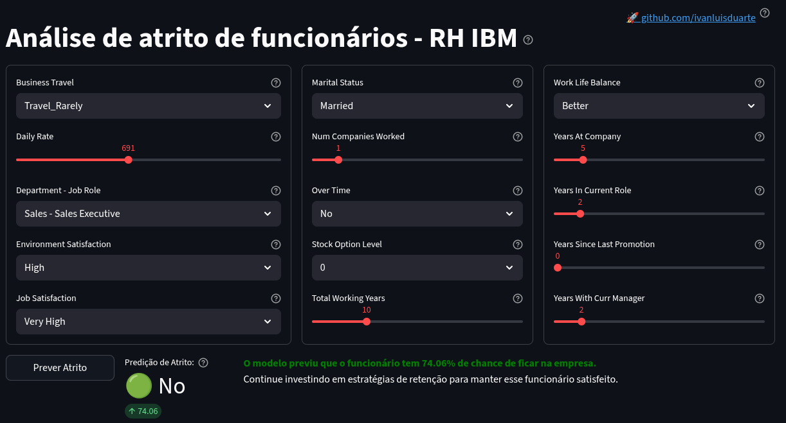

# Projeto: Análise de atrito de funcionários RH IBM.

**Descrição:** Projeto de ciência de dados para prever a saída (attrition) de funcionários,
utilizando o dataset IBM HR Analytics. O objetivo principal é apoiar a área de
Recursos Humanos (RH) na implementação de estratégias de retenção proativas.

**Autor:** Ivan Luís Duarte

**LinkedIn:** [linkedin.com/in/ivanluisduarte](https://www.linkedin.com/in/ivanluisduarte/ "https://www.linkedin.com/in/ivanluisduarte/")

**GitHub:** [github.com/ivanluisduarte](https://github.com/ivanluisduarte "https://github.com/ivanluisduarte")

**Data de Criação:** 2025-11-01

**Licença:** MIT

**Aplicação** [Análise de atrito de funcionários](https://atrito.streamlit.app "https://atrito.streamlit.app")



A aplicação está publicada em um ambiente gratuito da [Streamlit](https://streamlit.io/ "https://streamlit.io/") e "dorme" quando passa um tempo sem uso. Nesse caso, clique no botão azul da imagem abaixo e "acorde" a aplicação (isso pode levar dezenas de segundos para concluir):

 para acordar a aplicação")

# Sobre este projeto de ciência de dados

Baseado no modelo de [Francisco Bustamante](https://github.com/chicolucio/modelo_projeto_data_science "https://github.com/chicolucio/modelo_projeto_data_science"), que foi meu instrutor na base desse trabalho, no curso de ciência de dados da Hashtag Treinamentos.

Apesar da idéia inicial ser do curso da Hashtag Treinamentos, todas as decições sobre features, algorítmos e escolha de modelos foi refeita, melhorada e comentada. Um modelo com outras features foi usado ao final e a aplicação foi construída com um código mais simples e rápido.

Muitas funções foram criadas por mim, tornando esse projeto praticamente um framework para novos projetos de classificação. Uma sequência clara de uso das funções deixa a construção de pipelines, treinamento e análise de modelos de classificação rápida e intuitiva.

# Conceitos e observações

Atrito refere-se à redução gradual de empregados por meio de circunstâncias naturais, como aposentadoria, demissão voluntária por motivos pessoais, ou a decisão de não substituir empregados que estão de saída. Atrito pode levar a uma diminuição no tamanho da força de trabalho, mas é caracterizado por sua natureza voluntária e muitas vezes incontrolável. Organizações podem permitir o atrito para reduzir o tamanho de sua força de trabalho sem recorrer a demissões, vendo isso como uma forma menos disruptiva de ajustar seus níveis de pessoal.

Taxas de atrito podem fornecer insights sobre a satisfação dos empregados e tendências de longo prazo da força de trabalho.

## Importante

Leia o arquivo de [01_dicionario_de_dados.md](./referencias/01_dicionario_de_dados.md) para detalhes sobre a base.

## Organização do projeto

```
├── .gitignore         <- Arquivos e diretórios a serem ignorados pelo Git
├── app.py             <- Aplicação com a interface WEB para uso do modelo via streamlit
├── environment.yml    <- O arquivo de requisitos para reproduzir o ambiente de análise
├── LICENSE            <- Licença de código aberto (MIT)
├── README.md          <- README principal para desenvolvedores e recrutadores.
├── requirements.txt   <- O arquivo de requisitos para o app no streamlit
|
├── config             <- Arquivos de configuração para o app.
|
├── dados              <- Arquivos de dados para o projeto.
|
├── imagens            <- Arquivos de imagens do projeto.
|
├── modelos            <- Modelos treinados e serializados, previsões de modelos ou resumos de modelos
|
├── notebooks          <- Cadernos Jupyter. A convenção de nomenclatura é um número (para ordenação),
│                         as iniciais do criador e uma descrição curta separada por `-`, por exemplo
│                         `01-ild-eda.ipynb`.
|   └── 01-ild-eda.ipynb                   <- Análise exploratória e limpeza dos dados fictícios de RH da IBM.
|   ├── 02-ild-model_etp1.ipynb            <- Procura o melhor algorítmo para a classificação de atrito para a base com dimensionalidade reduzida.
|   ├── 02-ild-model_etp2.ipynb            <- Procura os melhores hiperparâmetros para o algorítmo de classificação vencedor da etapa anterior.
|   ├── 03-ild-metadados-aplicacao.ipynb   <- Prepara um dicionário de configuração para as colunas do modelo que vão para a aplicação.
│
|   └──src               <- Código-fonte para uso neste projeto.
|      │
|      ├── __init__.py   <- Torna um módulo Python
|      └── auxiliares.py <- Scripts de funções auxiliares que não são de gráficos e nem de modelos.
|      ├── config.py     <- Configurações básicas do projeto como pastas, arquivos e semente para replicar resultados.
|      └── graficos.py   <- Scripts para criar visualizações exploratórias e orientadas a resultados
|      └── models.py     <- Scripts para treinamento de modelos e avaliação de resultados.
|
├── referencias        <- Dicionários de dados, manuais e todos os outros materiais explicativos.
```

## 🚀 Modelo Preditivo de Attrition de Funcionários

Este projeto se concentra na aplicação de Machine Learning para prever a saída (attrition) de funcionários, utilizando o dataset IBM HR Analytics. O objetivo principal é apoiar a área de Recursos Humanos (RH) na implementação de estratégias de retenção proativas.

---

### 🎯 Objetivo de Negócio: Foco no Recall (Evitar Falsos Negativos)

Em problemas de classificação binária, como a previsão de Attrition, a escolha da métrica de avaliação é crucial e deve ser guiada pelos custos e benefícios de cada tipo de erro.

Neste contexto, definimos:

* **Classe Positiva (1):** O funcionário **sairá** (Attrition).
* **Classe Negativa (0):** O funcionário **ficará** (Sem Attrition).

O foco primário do modelo é **maximizar o Recall** (Sensibilidade) da classe positiva, ou seja,  **minimizar os Falsos Negativos (FNs)** .

| Previsão / Realidade                 | Attrition (1)                      | Não Attrition (0)                 |
| ------------------------------------- | ---------------------------------- | ---------------------------------- |
| **Previsto Attrition (1)**      | **Verdadeiro Positivo (VP)** | **Falso Positivo (FP)**      |
| **Previsto Não Attrition (0)** | **Falso Negativo (FN)**      | **Verdadeiro Negativo (VN)** |

---

### 📉 Justificativa de Prioridade: O Alto Custo do Falso Negativo (FN)

No domínio de RH, o **Falso Negativo (FN)** é o erro mais custoso, justificando a prioridade no  **Recall ()** .

#### 1. Falso Negativo (FN)

Um FN ocorre quando o modelo  **prevê que o funcionário VAI FICAR (0)** , mas ele  **realmente SAI (1)** .

| Erro                          | O que Acontece                                                          | Custo de Negócio                                                                                                                                                                                                                                                                                            |
| ----------------------------- | ----------------------------------------------------------------------- | ------------------------------------------------------------------------------------------------------------------------------------------------------------------------------------------------------------------------------------------------------------------------------------------------------------ |
| **Falso Negativo (FN)** | O colaborador que tinha intenção de sair é**ignorado**pelo RH. | **Alto Custo de Perda de Talento:**Envolve os custos diretos de recrutamento, seleção e treinamento de um substituto, além dos custos indiretos de perda de produtividade, conhecimento institucional e impacto negativo no moral da equipe.**Este é o maior prejuízo que o modelo deve evitar.** |

---

#### 2. Falso Positivo (FP)

Um FP ocorre quando o modelo  **prevê que o funcionário VAI SAIR (1)** , mas ele  **iria ficar (0)** .

| Erro                          | O que Acontece                                                                 | Custo de Negócio                                                                                                                                                                                                                                                 |
| ----------------------------- | ------------------------------------------------------------------------------ | ----------------------------------------------------------------------------------------------------------------------------------------------------------------------------------------------------------------------------------------------------------------- |
| **Falso Positivo (FP)** | O colaborador é abordado com ações de retenção, mas não precisava delas. | **Custo de Intervenção Desnecessária:**Envolve tempo do RH e do gestor, e o custo de um possível aumento de salário ou bônus de retenção. Embora seja um custo, é geralmente**muito menor**do que o custo de perder um funcionário crucial. |

---

### ✨ Conclusão

Embora a **Precisão ()** seja importante para garantir que as intervenções sejam eficazes e o orçamento de retenção não seja desperdiçado, o **custo da inação** (perder um talento) imposto pelo **Falso Negativo** é financeiramente e operacionalmente mais devastador para a organização.

Portanto, o modelo será ajustado para ter o  **maior Recall possível** , garantindo que o número máximo de funcionários em risco seja identificado e abordado, enquanto a Precisão é mantida em um nível operacionalmente aceitável.
# analise-atrito-rh-ibm_classificacao
